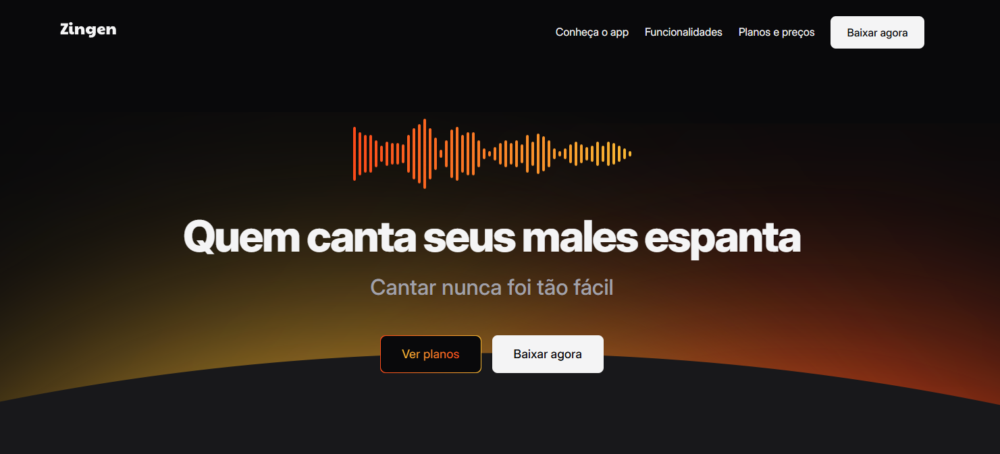

# 📰 Projeto: Zingen - Karaokê

Este é um projeto de uma página web responsiva desenvolvida com **HTML5** e **CSS3**, que tem como objetivo simular um aplicativo de karaokê inspirado no Spotify. Ele foi criado para praticar boas práticas de **design responsivo**, **estrutura semântica** e **layout em Grid/Flexbox**.

## 🔗 Acesse o projeto online
Você pode visualizar o site publicado via GitHub Pages clicando no link abaixo:

👉 [Acessar Zingen - Karaokê](https://llorenzojorge.github.io/projeto-zingen)

## 📌 Objetivo do projeto
Este projeto foi desenvolvido com fins educacionais, como parte da minha prática em desenvolvimento web front-end, com foco em responsividade, estruturação semântica, organização do layout com Grid/Flexbox e aplicação de efeitos visuais em CSS.
A proposta é simular a interface de um aplicativo de karaokê inspirado no Spotify, explorando conceitos de usabilidade e boas práticas de código e design.

## ✨ Funcionalidades
- Desenvolvimento com a metodologia **Mobile First**  
- Estrutura HTML semântica com seções bem organizadas  
- Layout utilizando **Flexbox e Grid**  
- Estilo moderno com **variáveis CSS** e efeitos visuais avançados  

## 🛠️ Tecnologias utilizadas
- HTML5
- CSS3 (com variáveis personalizadas)
- Git e GitHub
- GitHub Pages para deploy

## 📁 Estrutura básica do projeto
projeto-zingen/

├── index.html # Estrutura da página

├── assets/ # Imagens e ícones do projeto

├── styles/

  ├── global.css # Estilos base e variáveis

  ├── header.css # Estilos do cabeçalho e navegação

  ├── about.css # Estilos da section about

  ├── buttons.css # Estilos dos botões

  ├── donwload.css # Estilos da section donwload

  ├── features.css # Estilos da section features

  ├── footer.css # Estilos do footer

  ├── hero.css # Estilos da section hero

  ├── sections.css # Estilos das seções principais

  ├── pricing.css # Estilos da section pricing

  ├── social.css # Componente de menu e social links

  ├── utility.css # Classes utilitárias

  └── index.css # Arquivo central que importa os estilos

## 🚀 Como rodar localmente

1. Clone o repositório:
2. git clone https://github.com/llorenzojorge/projeto-zingen.git
3. Acesse a pasta do projeto:
4. Abra o arquivo `index.html` em seu navegador.

---

Desenvolvido por [Lorenzo Jorge](https://github.com/llorenzojorge) 💻
